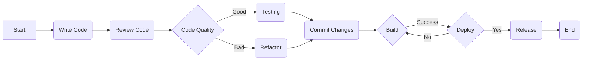

### Welcome to My GitHub! 🌎

👋 Hey there! I'm Houssam, and I'm passionate about Computer Science. 
🚀 I'm a FullStack Web Enginner with a strong background in Node/PHP and a love for open-source development. 
🌱 My journey in the tech world is an ongoing adventure, and I'm always learning and growing. If you're interested in collaborating, have feedback, or just want to connect, feel free to reach out. 
📫 You can contact me via email at ouatmanihoussam[at]gmail.com. 
🌟 Thanks for stopping by, and happy coding! 

### Programming Langages

       &emsp;
       &emsp;
        &emsp;
        &emsp;
          

### Frameworks

!

### Databases
!

          
### I Work With:

### Stats

### Code Wars
Profile  (<https://www.codewars.com/users/HoussDev>)

### Fun

